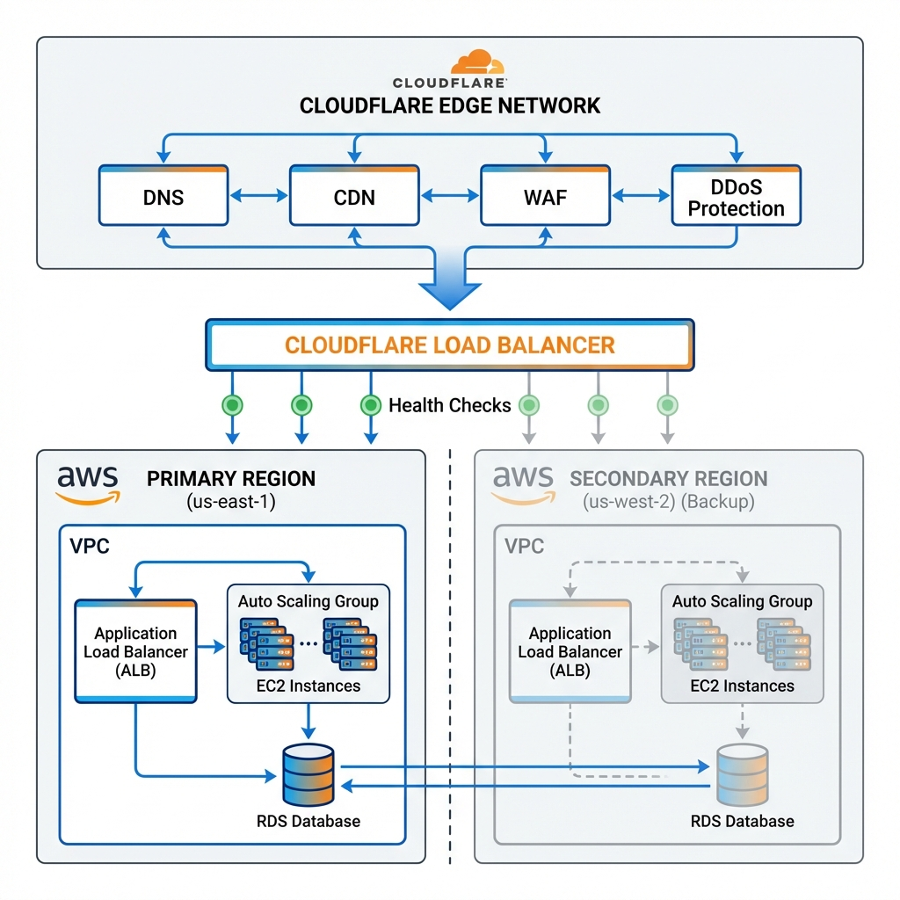

# Cloudflare + AWS Integration Demo

## 🚀 Project Overview

This repository demonstrates a **production-ready integration** between **Cloudflare** and **AWS infrastructure**, showcasing:

- ✅ Complete DNS and CDN configuration
- ✅ SSL/TLS certificate management with automatic renewal
- ✅ WAF (Web Application Firewall) rules and DDoS protection
- ✅ Multi-region failover and disaster recovery strategy
- ✅ Health monitoring and automated failover
- ✅ Infrastructure as Code (Terraform)
- ✅ Performance optimization and caching strategies
- ✅ Production-ready Health Check API

## 📋 Table of Contents

- [Architecture Overview](#architecture-overview)
- [Features](#features)
- [Prerequisites](#prerequisites)
- [Quick Start](#quick-start)
- [Fallback Strategy](#fallback-strategy)
- [Monitoring & Verification](#monitoring--verification)
- [Security Configuration](#security-configuration)
- [Cost Optimization](#cost-optimization)
- [Troubleshooting](#troubleshooting)

## 🏗️ Architecture Overview



### Architecture Diagram Explanation

This architecture implements a **highly available, multi-region deployment** with automatic failover:

**Top Layer - Cloudflare Edge Network:**
- Global DNS management with DNSSEC
- CDN with 275+ Points of Presence worldwide
- Web Application Firewall (WAF) protecting against OWASP Top 10
- DDoS protection at layers 3, 4, and 7

**Middle Layer - Intelligent Load Balancing:**
- Cloudflare Load Balancer with health checks every 30 seconds
- Automatic traffic routing to healthy regions
- Dynamic latency-based steering for optimal performance

**Bottom Layer - Multi-Region AWS Infrastructure:**
- **Primary Region (us-east-1)**: Full production capacity
  - VPC with public/private subnet architecture
  - Application Load Balancer with SSL termination
  - Auto Scaling Group with EC2/ECS instances
  - RDS database with Multi-AZ deployment
  
- **Secondary Region (us-west-2)**: Standby for failover
  - Identical architecture with reduced capacity
  - RDS Read Replica (can be promoted to primary)
  - Automatic activation during primary region failure

**Data Replication:**
- Bidirectional arrows show database replication between regions
- Near real-time synchronization (< 5 second lag)
- Ensures data consistency during failover

```
┌─────────────────────────────────────────────────────────────┐
│                      CLOUDFLARE EDGE                        │
│  ┌──────────┐  ┌──────────┐  ┌──────────┐  ┌──────────┐   │
│  │   DNS    │  │   CDN    │  │   WAF    │  │  DDoS    │   │
│  └──────────┘  └──────────┘  └──────────┘  └──────────┘   │
└─────────────────────────────────────────────────────────────┘
                            │
                            ▼
┌─────────────────────────────────────────────────────────────┐
│                    LOAD BALANCER                            │
│         (Health Checks + Automatic Failover)                │
└─────────────────────────────────────────────────────────────┘
                            │
            ┌───────────────┴───────────────┐
            ▼                               ▼
┌───────────────────────┐       ┌───────────────────────┐
│   PRIMARY REGION      │       │   BACKUP REGION       │
│   (us-east-1)         │       │   (us-west-2)         │
│                       │       │                       │
│  ┌─────────────────┐  │       │  ┌─────────────────┐  │
│  │  ALB/NLB        │  │       │  │  ALB/NLB        │  │
│  └─────────────────┘  │       │  └─────────────────┘  │
│          │            │       │          │            │
│  ┌───────▼────────┐   │       │  ┌───────▼────────┐   │
│  │  ECS/EKS/EC2   │   │       │  │  ECS/EKS/EC2   │   │
│  │  Auto Scaling  │   │       │  │  Auto Scaling  │   │
│  └────────────────┘   │       │  └────────────────┘   │
│          │            │       │          │            │
│  ┌───────▼────────┐   │       │  ┌───────▼────────┐   │
│  │  RDS (Primary) │   │       │  │ RDS (Replica)  │   │
│  │  ElastiCache   │   │       │  │ ElastiCache    │   │
│  └────────────────┘   │       │  └────────────────┘   │
└───────────────────────┘       └───────────────────────┘
```

## ✨ Features

### 1. **Cloudflare Integration**
- DNS management with DNSSEC
- Global CDN with edge caching
- SSL/TLS encryption (Full Strict mode)
- Page Rules for performance optimization
- Rate limiting and bot protection

### 2. **AWS Infrastructure**
- Multi-region deployment (Primary + Backup)
- Application Load Balancer with health checks
- Auto-scaling groups for compute resources
- RDS with cross-region replication
- S3 for static assets with CloudFront fallback
- Route53 health checks and failover routing

### 3. **Security**
- WAF rules (OWASP Top 10 protection)
- DDoS mitigation (Layer 3, 4, and 7)
- SSL/TLS certificate automation
- Security headers (HSTS, CSP, X-Frame-Options)
- IP whitelisting/blacklisting
- Rate limiting per endpoint

### 4. **Fallback & Disaster Recovery**
- Automatic health monitoring
- Multi-region failover (< 60 seconds)
- Database replication and backup
- Static site fallback for critical outages
- Automated rollback procedures

### 5. **Monitoring & Alerts**
- CloudWatch metrics and alarms
- Cloudflare Analytics integration
- Custom health check endpoints
- Slack/Email/PagerDuty notifications
- Performance tracking dashboard

## 📦 Prerequisites

- **AWS Account** with appropriate permissions
- **Cloudflare Account** (Pro plan or higher recommended)
- **Terraform** >= 1.5.0
- **AWS CLI** configured
- **Domain name** registered and accessible

## 🚀 Quick Start

### Step 1: Clone the Repository

```bash
git clone https://github.com/yourusername/cloudflare-aws-integration-demo.git
cd cloudflare-aws-integration-demo
```

### Step 2: Configure Variables

```bash
cd terraform
cp terraform.tfvars.example terraform.tfvars
# Edit terraform.tfvars with your specific values
```

### Step 3: Initialize Terraform

```bash
terraform init
```

### Step 4: Review the Plan

```bash
terraform plan
```

### Step 5: Deploy Infrastructure

```bash
terraform apply
```

### Step 6: Verify Integration

```bash
# Run the verification script
cd ../scripts
./verify-integration.sh
```

## 🔄 Fallback Strategy

### Multi-Layer Failover Approach

#### Layer 1: Cloudflare Load Balancer
- **Health Checks**: Every 30 seconds
- **Failover Time**: < 30 seconds
- **Monitors**: HTTP/HTTPS endpoints on both regions

#### Layer 2: Route53 Health Checks
- **Backup DNS failover** if Cloudflare experiences issues
- **Health Check Interval**: 30 seconds
- **Failover Time**: 60-90 seconds

#### Layer 3: Static Fallback Page
- **S3-hosted maintenance page** served via Cloudflare Workers
- **Triggers**: When both regions fail health checks
- **Purpose**: Maintain brand presence and communication

### Failover Testing

```bash
# Simulate primary region failure
cd scripts
./test-failover.sh --region us-east-1 --action disable

# Monitor failover process
./monitor-failover.sh

# Restore primary region
./test-failover.sh --region us-east-1 --action enable
```

## 📊 Monitoring & Verification

### Health Check Endpoints

```
Primary Region:   https://api.yourdomain.com/health
Secondary Region: https://api-backup.yourdomain.com/health
```

### Monitoring Dashboard

Access the monitoring dashboard:
```
https://yourdomain.com/monitoring
```

### Key Metrics Tracked

1. **Availability**: Uptime percentage (Target: 99.99%)
2. **Latency**: Response time (Target: < 200ms)
3. **Error Rate**: 5xx errors (Target: < 0.1%)
4. **Cache Hit Ratio**: Cloudflare cache performance (Target: > 80%)
5. **Bandwidth**: Data transfer and cost optimization

### Automated Alerts

- **Critical**: Immediate PagerDuty notification
- **Warning**: Slack channel notification
- **Info**: Email digest (daily)

## 🔒 Security Configuration

### WAF Rules Implemented

1. **OWASP Top 10 Protection**
   - SQL Injection
   - XSS (Cross-Site Scripting)
   - CSRF (Cross-Site Request Forgery)
   - File Inclusion

2. **Rate Limiting**
   - API endpoints: 100 requests/minute per IP
   - Login endpoints: 5 attempts/minute per IP
   - Search endpoints: 20 requests/minute per IP

3. **Geo-Blocking** (Optional)
   - Block/Allow specific countries
   - Challenge suspicious regions

4. **Bot Management**
   - Block known bad bots
   - Challenge suspicious user agents
   - Allow verified bots (Google, Bing, etc.)

### SSL/TLS Configuration

- **Mode**: Full (Strict)
- **Minimum TLS Version**: 1.2
- **Cipher Suites**: Modern, secure ciphers only
- **HSTS**: Enabled with 1-year max-age
- **Certificate**: Cloudflare Universal SSL + AWS ACM

## 💰 Cost Optimization

### Cloudflare
- **Plan**: Pro ($20/month) or Business ($200/month)
- **Load Balancer**: $5/origin per month
- **Rate Limiting**: Included in Pro plan

### AWS (Estimated Monthly)
- **EC2/ECS**: $100-500 (depending on scale)
- **ALB**: $20-40
- **RDS**: $50-200
- **Data Transfer**: $50-150
- **Route53**: $1-5
- **Total**: ~$221-895/month

### Cost Savings Strategies
- Cloudflare caching reduces AWS bandwidth costs by 60-80%
- Auto-scaling reduces compute costs during low traffic
- Reserved instances for predictable workloads

## 🐛 Troubleshooting

### Common Issues

#### 1. DNS Not Resolving
```bash
# Check DNS propagation
dig yourdomain.com @1.1.1.1
nslookup yourdomain.com 1.1.1.1
```

#### 2. SSL Certificate Errors
```bash
# Verify SSL configuration
curl -vI https://yourdomain.com
openssl s_client -connect yourdomain.com:443
```

#### 3. Health Check Failures
```bash
# Test health endpoint directly
curl -v https://your-alb-endpoint.amazonaws.com/health
```

#### 4. Failover Not Working
```bash
# Check Cloudflare Load Balancer status
cd scripts
./check-lb-status.sh
```

## 📚 Documentation

- [Architecture Deep Dive](./docs/architecture.md)
- [Terraform Module Documentation](./docs/terraform.md)
- [Runbook for Operations](./docs/runbook.md)
- [Disaster Recovery Procedures](./docs/disaster-recovery.md)
- [Performance Tuning Guide](./docs/performance.md)

## 🤝 Support & Maintenance

### 1-Month Verification Period

- **Week 1**: Initial deployment and monitoring setup
- **Week 2**: Performance optimization and tuning
- **Week 3**: Failover testing and validation
- **Week 4**: Documentation handover and knowledge transfer

### Availability
- **Timezone**: PKT (UTC+5) - Flexible hours available
- **Response Time**: < 2 hours for critical issues
- **Communication**: Slack, Email, Video calls

## 📞 Contact

For questions or support during the verification period:
- **Email**: hadeeda5@gmail.com
- **GitHub**: @hadeedahmed254
- **Timezone**: Pakistan Standard Time (UTC+5)

## 📄 License

This project is provided as a demonstration. Customize as needed for your specific use case.

---

**Last Updated**: February 2026  
**Version**: 1.0.0  
**Maintained By**: Hadeed Ahmed
